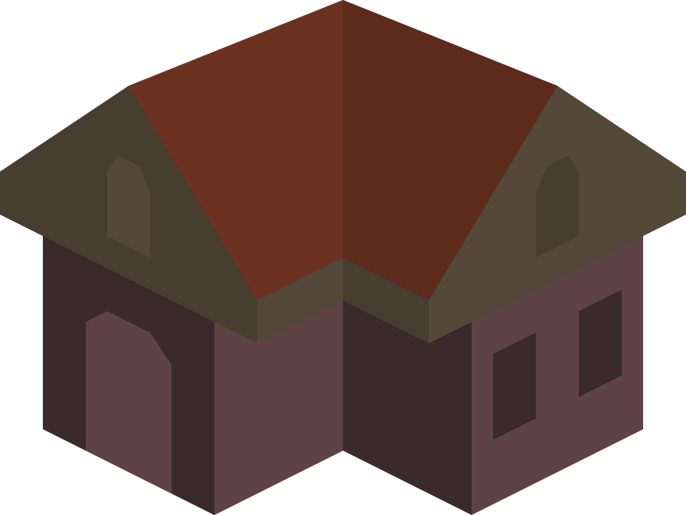

# Clone do YouTube - Desafio Flexbox DIO



Este projeto é um clone simplificado da interface principal do YouTube, desenvolvido como parte do desafio de CSS com Flexbox da DIO.

## 🎯 Objetivos

- Praticar Flexbox com HTML e CSS
- Entender como estruturar uma interface responsiva
- Reproduzir visualmente um layout real (referência: Figma)

## 🧩 Estrutura

- `index.html` - Estrutura da página
- `style.css` - Estilização com Flexbox
- `imagens/` - Ícones e avatar

## 👨‍💻 Desenvolvido por

Por Gabriel Demetrios Lafis, estudante universitário de Ciência de Dados, integrando design e desenvolvimento para criar interfaces funcionais e organizadas.

## 🔗 Protótipo

[Figma Oficial](https://www.figma.com/design/lrRWUZPKnqMDZrSDJmZxUS/Desafio-de-Flexbox---DIO?node-id=0-1&p=f)

## 📋 Descrição

Este repositório contém o código-fonte de um clone simplificado da interface do YouTube, focado na aplicação de conceitos de Flexbox em HTML e CSS. O objetivo principal foi recriar o layout visual da plataforma, demonstrando habilidades em estruturação de páginas web e estilização responsiva. O projeto inclui a página principal com a barra de navegação superior, barra lateral e a área de exibição de vídeos, tudo construído para ser visualmente fiel ao protótipo original do Figma.

## 📦 Instalação

Para executar este projeto localmente, siga os passos abaixo:

1.  **Clone o repositório:**
    ```bash
    git clone https://github.com/galafis/Clonando-a-Pagina-do-Youtube-com-CSS.git
    ```
2.  **Navegue até o diretório do projeto:**
    ```bash
    cd Clonando-a-Pagina-do-Youtube-com-CSS
    ```
3.  **Abra o arquivo `index.html` no seu navegador:**
    Você pode simplesmente clicar duas vezes no arquivo `index.html` ou abri-lo através do seu editor de código preferido e usar a funcionalidade "Open with Live Server" (se disponível).

## 💻 Uso

Após a instalação, o projeto pode ser visualizado diretamente no navegador. A interface simula a página inicial do YouTube, permitindo a exploração do layout e da responsividade. Não há funcionalidades interativas avançadas (como reprodução de vídeo real ou busca), pois o foco é puramente no design e na estrutura front-end com HTML e CSS.

## 📄 Licença

Este projeto está licenciado sob a Licença MIT. Sinta-se à vontade para usar, modificar e distribuir o código, desde que a atribuição original seja mantida. Veja o arquivo `LICENSE` para mais detalhes.

---

# YouTube Clone - Flexbox DIO Challenge


This project is a simplified clone of the main YouTube interface, developed as part of the DIO's CSS Flexbox challenge.

## 🎯 Objectives

- Practice Flexbox with HTML and CSS
- Understand how to structure a responsive interface
- Visually reproduce a real layout (reference: Figma)

## 🧩 Structure

- `index.html` - Page structure
- `style.css` - Styling with Flexbox
- `imagens/` - Icons and avatar

## 👨‍💻 Developed by

By Gabriel Demetrios Lafis, a university student of Data Science, integrating design and development to create functional and organized interfaces.

## 🔗 Prototype

[Official Figma](https://www.figma.com/design/lrRWUZPKnqMDZrSDJmZxUS/Desafio-de-Flexbox---DIO?node-id=0-1&p=f)

## 📋 Description

This repository contains the source code for a simplified clone of the YouTube interface, focused on applying Flexbox concepts in HTML and CSS. The main objective was to recreate the platform's visual layout, demonstrating skills in web page structuring and responsive styling. The project includes the main page with the top navigation bar, sidebar, and video display area, all built to be visually faithful to the original Figma prototype.

## 📦 Installation

To run this project locally, follow the steps below:

1.  **Clone the repository:**
    ```bash
    git clone https://github.com/galafis/Clonando-a-Pagina-do-Youtube-com-CSS.git
    ```
2.  **Navigate to the project directory:**
    ```bash
    cd Clonando-a-Pagina-do-Youtube-com-CSS
    ```
3.  **Open the `index.html` file in your browser:**
    You can simply double-click the `index.html` file or open it through your preferred code editor and use the "Open with Live Server" functionality (if available).

## 💻 Usage

After installation, the project can be viewed directly in the browser. The interface simulates the YouTube home page, allowing exploration of the layout and responsiveness. There are no advanced interactive functionalities (such as real video playback or search), as the focus is purely on the design and front-end structure with HTML and CSS.

## 📄 License

This project is licensed under the MIT License. Feel free to use, modify, and distribute the code, provided that the original attribution is maintained. See the `LICENSE` file for more details.

